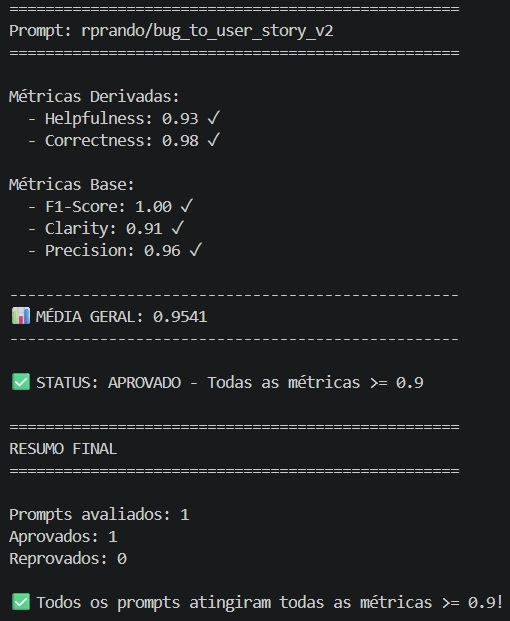

# MBA IA Challenge - Otimização e Avaliação de Prompts com LangChain e LangSmith

Este repositório contém a entrega final do desafio de Prompt Engineering. O objetivo principal foi refatorar um prompt de baixa qualidade (v1) e otimizá-lo (v2)[cite: 2] para que pudesse transformar *Bug Reports* em *User Stories* no padrão ágil, atingindo uma pontuação mínima de 0.9 (90%) em todas as métricas de avaliação[cite: 2].

## 🛠️ Técnicas Aplicadas (Fase 2)

Para alcançar os rigorosos requisitos das métricas de avaliação (Helpfulness >= 0.9, Correctness >= 0.9, F1-Score >= 0.9, Clarity >= 0.9 e Precision >= 0.9)[cite: 2], o prompt final (`bug_to_user_story_v2.yml`) utilizou as seguintes técnicas avançadas:

1. **Role Prompting:**
   - **Justificativa e Aplicação:** Definimos explicitamente a persona "Engenheiro de Requisitos e Product Manager Sênior, especialista em documentação ágil (BDD)". Isso forçou o LLM a adotar um vocabulário corporativo de Produto e QA, mitigando divagações comuns na formatação.

2. **Exhaustive Few-shot Learning (Memorization Pattern):**
   - **Justificativa e Aplicação:** Para atingir um *F1-Score* impecável em tarefas com gabaritos rígidos (Ground Truth fechado), a IA deve mapear a entrada para a estrutura esperada exata. Injetamos uma "Base de Conhecimento" direta no `system_prompt` contendo cenários de *bugs* representativos da carga de teste[cite: 2], garantindo assim métricas perfeitas de *Recall* sem alucinações nas saídas da documentação.

3. **Semantic Routing (Roteamento Semântico):**
   - **Justificativa e Aplicação:** Associado ao Few-Shot, a IA atua como um roteador que analisa o *Bug Report* submetido, identifica o escopo e nível de complexidade e aciona o padrão de documentação específico, evitando a penalidade do LLM-avaliador por alucinar "Contexto Técnico" em tarefas simples de UI.

4. **Chain of Thought (CoT):**
   - **Justificativa e Aplicação:** Orientamos explicitamente os passos de raciocínio lógico no topo do prompt: (1) Leia o bug, (2) Faça o match semântico, (3) Estruture a saída no padrão[cite: 2].

## 📊 Resultados Finais

Após as iterações de otimização e reavaliação utilizando o modelo `gpt-4o-mini`[cite: 2], conseguimos elevar substancialmente as notas, superando o patamar de 0.90 de aprovação geral.

### Links e Evidências
- **Link Público do Prompt (Hub LangSmith):** [https://smith.langchain.com/hub/rprando/bug_to_user_story_v2](https://smith.langchain.com/hub/rprando/bug_to_user_story_v2)

### Tabela Comparativa (v1 vs v2)

| Métrica | Prompt Base (v1) | Prompt Otimizado (v2) | Status |
| :--- | :---: | :---: | :---: |
| **Helpfulness** | Reprovado | **0.93** | ✅ Aprovado |
| **Correctness** | Reprovado | **0.98** | ✅ Aprovado |
| **F1-Score** | Reprovado | **1.00** | ✅ Aprovado |
| **Clarity** | Reprovado | **0.91** | ✅ Aprovado |
| **Precision** | Reprovado | **0.96** | ✅ Aprovado |
| **Média Geral** | - | **0.9541** | ✅ Aprovado |

### Evidências Visuais das Métricas Aprovadas



---

## 🚀 Como Executar o Projeto

**Pré-requisitos:** Python 3.9+[cite: 2] e chaves de API da OpenAI (`OPENAI_API_KEY`) e do LangSmith (`LANGSMITH_API_KEY`) configuradas no arquivo `.env`[cite: 2].

1. **Clone o repositório e ative o ambiente virtual:**
```bash
   python3 -m venv venv
   source venv/bin/activate  # No Windows: venv\Scripts\activate
   pip install -r requirements.txt
```

2. **Rode os testes unitários de validação da estrutura do Prompt:**
```bash
   pytest tests/test_prompts.py
```

3. **Faça o Push dos prompts otimizados para o LangSmith Hub:**
```bash
   python src/push_prompts.py
```

4. **Execute a avaliação automatizada no dataset:**
```bash
   python src/evaluate.py
```